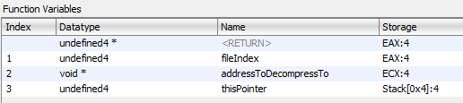

# Getting Started

## Introduction

In this article, will quickly-ish demonstrate simple usage allowing you to get started with Reloaded.Hooks.

As this library, was originally created to deal with modifying and reverse engineering games; many of the examples in this documentation show snippets of real game functions as opposed to common APIs. That said, nothing changes when hooking arbitrary APIs.

## Adding Reloaded.Hooks to your project.
1.  Open/Create project in Visual Studio.
2.  Right-click your project within the Solution Explorer and select “Manage NuGet Packages…”.
3.  Search for "Reloaded.Hooks”.
4.  Install the package.

## Prologue: Definiting Functions

Calling, hooking and performing other operations with native functions with Reloaded.Hooks is performed through the use of delegate declarations.

Reloaded.Hooks' main library is able to create individual *delegate* instances given supplied function addresses in memory - allowing you to use native functions as if they were your own.

### Defining Reloaded-Compatible Delegates

Defining delegates to call native functions under Reloaded.Hooks is performed just like defining regular delegates with only one catch. **You must inform Reloaded.Hooks of the kind of function you are going to call with the use of Reloaded's own `FunctionAttribute`**.

There are two `FunctionAttribute`(s), namely `X86.FunctionAttribute` and `X64.FunctionAttribute` for x86 and x64 respectively. Depending on your project you may wish to apply one, the other or both.


Note: Examples bwlow have been lifted from real pieces of source code.

### Example: Native CDECL Function

```csharp
/* RenderWare Graphics | Function that is step one to widescreen hacks in RenderWare games. */
[Function(CallingConventions.Cdecl)]
public delegate void RwCameraSetViewWindow(ref RWCamera RwCamera, ref RWView view);
```

### Example: Function with registers as parameters

!!! info

    In the real world, compilers will often optimise function calls to optimise for performance. This will often lead to the function using non-standard conventions, such e.g. accepting parameters via registers where normally the stack should be used.  

    This is more common in x86 (32-bit) applications rather than x64 applications.  

Reloaded.Hooks allows for mapping parameters to given registers.  

```csharp
/// <summary>
/// Reads a ANM/HAnim stream from a .ONE archive. Returns address of a decompressed ANM file.
/// </summary>
/// <param name="fileIndex">[EAX] The index of the file inside the .ONE archive (starting with 2)</param>
/// <param name="addressToDecompressTo">[ECX] The address to which the file inside the ONE archive will be decompressed to.</param>
/// <param name="thisPointer">"This" pointer for the ONEFILE class instance.</param>
/// <returns>The address containing the read in ANM (RenderWare Hierarchical Animation) stream.</returns>
[Function(new[] { Register.eax, Register.ecx }, Register.eax, StackCleanup.Callee)]
public delegate int OneFileLoadHAnimation(int fileIndex, void* addressToDecompressTo, ref ONEFILE thisPointer);
/* Lifted from a disassembly of Sonic Heroes */
```

*This was an example of a custom function with the following properties:*

- Two parameters (left to right) in registers `EAX` and `ECX`. 
- Return register of `EAX`. 
- "Callee" stack cleanup, i.e. the stack pointer is reset at the end of the function either via `ret X` (XXX Stdcall) or `add esp, X`. 

Those with some experience in reverse engineering might know that the popular IDA decompiler would identify such function as `userpurge`.

For custom functions, under the hood `Reloaded.Hooks` creates wrappers that automatically convert between [calling conventions](https://en.wikipedia.org/wiki/Calling_convention) such as the special one above that uses registers. These wrappers are actually what will be called behind the scenes as you call/hook your native functions, doing all the difficult work for you ❤.


#### Deciphering the Function Signature

!!! info

    Some disassemblers may contain useful information about how the function is called.  
    Below is guidance on deciphering the function signatures in some common disassemblers.  

    Please note that disassemblers are not perfect; they can and will sometimes make mistakes.
 

**IDA Pro (Decompiler):** 
```csharp
// Example
void* __userpurge OneFileLoadHAnimation@<eax>(RwUInt32 type@<eax>, void *dest@<ecx>, ONEFILE *this)

// Breakdown
FUNCTION_NAME@<eax> in function name specifies return register is EAX.
type@<eax> specifies the `type` argument is passed via EAX register.
dest@<ecx> specifies the `dest` argument is passed via ECX register.
remaining parameters are passed via stack.

// Extra Info (IDA Specific)
_userpurge == 'Callee' Stack Cleanup
_usercall == 'Caller' Stack Cleanup
```

**Ghidra:** 

Right click function name and click `Edit Function`.  
Inside the dialog, you will find the following:  

  

Note: Ghidra did not disassemble this correctly; I manually fixed this function for this example.  

**Binary Ninja:**

This one is pretty self explanatory.  

```csharp
// Example
void* __stdcall OneFileLoadHAnimation(int32_t arg1 @ eax, char* arg2 @ ecx, char* arg3)
```

**General:**  
Some disassemblers might not provide information on return registers and/or stack cleanup because they are implied by the given convention (such as `__stdcall`). Consider using the following presets in `Reloaded.Hooks` to determine these settings.  

- [X86 Calling Conventions (Presets)](https://github.com/Reloaded-Project/Reloaded.Hooks/blob/496d52fae5290a43ff2cbba0400b8ec46e6207b3/source/Reloaded.Hooks.Definitions/X86/CallingConventions.cs#L30)
- [X64 Calling Conventions (Presets)](https://github.com/Reloaded-Project/Reloaded.Hooks/blob/496d52fae5290a43ff2cbba0400b8ec46e6207b3/source/Reloaded.Hooks.Definitions/X64/CallingConventions.cs#L24)

### Important Note About the API

This is just a quick note before we introduce any direct code examples.

To make things convenient, high level functions for all the features of the library are available within the `ReloadedHooks` class (`Reloaded.Hooks.ReloadedHooks`). These automatically detect if the current process is x86/x64 and use the appropriate underlying API. 

Please assume any usage of `ReloadedHooks` is an instance of `Reloaded.Hooks.ReloadedHooks`, which you can get easily via `ReloadedHooks.Instance`.

## Calling Functions

In order to create an instance of your own custom delegate from a supplied function pointer, `ReloadedHooks.CreateWrapper` function is used. These will return you an instance of your requested function at address which you can call like a native function.

```csharp
// Based on the delegate above.
var rwCameraSetViewWindow = ReloadedHooks.Instance.CreateWrapper<RwCameraSetViewWindow>(0x0064AC80);

// You may now call the delegate instance/native/game fuction like if it was your own.
rwCameraSetViewWindow(camera, view);
```

Regarding the other, more complex nonstandard function seen above that has been optimized out by the compiler - nothing changes. The process is exactly the same and saves you having to write what would otherwise be custom inline assembly in the C++ world.

Lower level APIs:

- `Reloaded.Hooks.X86.Wrapper`
- `Reloaded.Hooks.X64.Wrapper`

## Hooking Functions

The hooking of arbitrary functions in Reloaded can also be considered a simple walk in the park.
Below is a simple example of how you could hook a Win32 API to print out all files being opened by the current program.

### Example: File Monitor

```csharp
/* You MUST store the returned hook to prevent the Garbage Collector 
   from freeing your hook function (CreateFileAImpl). */

/* Fields */
private IHook<CreateFileA> _createFileAHook; 

/* Constructor */
public SomeClass()
{
    // Get Address of Windows API function.
    IntPtr kernel32Handle = LoadLibraryW("kernel32");
    IntPtr createFileAPointer = GetProcAddress(kernel32Handle, "CreateFileA");  

    _createFileAHook = ReloadedHooks.Instance.CreateHook<CreateFileA>(CreateFileAImpl, (long)createFileAPointer).Activate();
}

/* Hook Function */

/// <summary>
/// Contains the implementation of the CreateFileA hook.
/// Simply prints the file name to the console and calls + returns the original function.
/// </summary>
private static IntPtr CreateFileAImpl(string filename, FileAccess access, FileShare share, IntPtr securityAttributes, FileMode creationDisposition, FileAttributes flagsAndAttributes, IntPtr templateFile)
{
    // If statement filters out non-files such as HID devices;
    if (!filename.StartsWith(@"\\?\"))
        Bindings.PrintInfo($"[CFA] Opening File {filename}");

    // Calls the original function we hooked and returns its value.
    return _createFileAHook.OriginalFunction(filename, access, share, securityAttributes, creationDisposition, flagsAndAttributes, templateFile);
}
```

There is nothing extra you need to do. `Reloaded.Hooks` handles everything for you under the hood such as calculating hook lengths and handling register parameters for special functions. You will never have to do silly error prone stuff such as writing custom inline assembler by hand. 

Reloaded's hooking code is really, really powerful, even patching common forms of hooks created by other programs and libraries for maximum compatibility (you can hook hooks!). For example, you can easily hook DirectX 9's `EndScene` or `Present` without breaking the Steam Overlay; this is something people normally struggle with and write dirty hacks to get around.

Lower level APIs:

- `Reloaded.Hooks.Hook`

### Marshalling Support

As `Reloaded.Hooks` uses .NET delegates, for both hooking and calling function, there is support for extra features such as marshalling. Here is an example:

```csharp
/*
    Within native code this individual function would be expressed as "int PlayADX(char* fileName)",
    here thanks to marshalling we are able to simply specify it as a string.
    
    In this specific case, additionally, CharSet = CharSet.Ansi must be specified as the game from
    which this function originates from did not use the Unicode encoding that is default in C#. 
*/

[Function(CallingConventions.Cdecl)]
[UnmanagedFunctionPointer(CallingConvention.Cdecl, CharSet = CharSet.Ansi)
public delegate int PlayADX(string fileName); 
/* Sourced from a clean room disassembly of Sonic Heroes */
```

## Pointers to .NET Functions

No hacking adventure would be ever complete with pointers to our own functions.

`Reloaded.Hooks` supports this and as you'd expect, making life very easy for you. You can even make pointers to C# functions with custom calling conventions; e.g. effectively create a `fastcall` method in C#.

Support for this functionality is provided through the use of the `CreateReverseWrapper` function. This returns a class, which contains a property `WrapperPointer` that can be used to call the C# function from native code.

```csharp
/*  You MUST store the returned ReverseWrapper to prevent the Garbage Collector 
    from freeing your function (CSharpFastcallFunction). */

// Define an x86 fastcall function (via template).
// Microsoft Fastcall passes first two parameters in registers ECX, EDX and returns value in EAX.
[Function(CallingConventions.Fastcall)]
public delegate void FastcallExample(int a, int b, int c);

/* Fields */
private IReverseWrapper<FastcallExample> _reverseFunctionWrapper;
private FastcallExample                  _functionWrapper;

/* Main/Init Method */
void FastcallCSharpFunctionPointerTest()
{
    // Create wrapper to make our "C# fastcall" function.
    _reverseFunctionWrapper = ReloadedHooks.Instance.CreateReverseWrapper<FastcallExample>(CSharpFastcallFunction);

    // To prove our "C# fastcall" function works, let's just call it like a native function.
    _functionWrapper = ReloadedHooks.Instance.CreateWrapper<FastcallExample>((long)_reverseFunctionWrapper.WrapperPointer);
    _functionWrapper(1,2,3);
}


/* Function Implementation */

/// <summary>
/// When called through the address in reverseFunctionWrapper.Pointer,
/// this function is now a "fastcall" function.
/// </summary>
/// <param name="a">This number is passed via ECX register!</param>
/// <param name="b">This number is passed via EDX register!</param>
/// <param name="c">This number is on the stack.</param>
private static void CSharpFastcallFunction(int a, int b, int c)
{
    MessageBox.Show($"{a + b + c}");
}
```

Lower level APIs:

- `Reloaded.Hooks.X86.ReverseWrapper`
- `Reloaded.Hooks.X64.ReverseWrapper`

### In Assembly Code

If you would like to call managed C# code from assembly code generated at run-time (such as `AsmHook`), consider using the `ReloadedHooksUtilities.GetAbsoluteCallMnemonics` helper function to generate the appropriate x86/x64 call instruction.

```csharp
// SomeFunction is a Stdcall C# function accepting two integers.
// _reverseWrapAddFunction is a `ReverseWrapper`, it is a class member.
string[] function = 
{
    $"use32",

    // Backup registers meant to be saved by caller. 
    // Not always necessary but good practice to do so!
    $"{Utilities.PushCdeclCallerSavedRegisters()}" 
                                                   
    $"push ecx", // Right Parameter
    $"push edx", // Left Parameter
    $"{Utilities.GetAbsoluteCallMnemonics(SomeFunction, out _reverseWrapAddFunction)}",

    // Restore backed up registers.
    $"{Utilities.PopCdeclCallerSavedRegisters()}" 
    $"ret"
};

// You should reference the ReverseWrapper (out parameter) as long as you plan on using the
// native/ASM function. Failure to do so will cause issues after Garbage Collection occurs. 
```

The calling convention of your C# function is controlled by `UnmanagedFunctionPointerAttribute` for Delegates (default is `StdCall`). While not always necessary*, it is good practice that you wrap your call with `PushCdeclCallerSavedRegisters` and `PopCdeclCallerSavedRegisters` respectively (for both Cdecl and Stdcall). 

For a more advanced example, consider looking at [CSharpFromAssembly.cs](https://github.com/Reloaded-Project/Reloaded.Hooks/blob/2f58cee30ffc144cd33142ab46f194a4fdf2cdef/Source/Reloaded.Hooks.Tests.X64/CSharpFromAssembly.cs#L102) from Reloaded.Hooks' test code.

\* This depends on context; if using an assembly hook, the original function might be doing the backup/restore for you already. If you are unsure, you should always backup and restore.

## Misc Performance Notes

- Reloaded has checks and 'hot paths' implemented to prevent creating unnecessary wrappers.
  - For example, if you call `CreateReverseWrapper<T>` for a function marked `Stdcall` with `FunctionAttribute` and the target function is already Stdcall, no wrapper will be generated and the input pointer will be returned.

- You can reduce the overhead of transitions between native code and .NET by [using Function Pointers](./FunctionPointers.md) (C#9).
